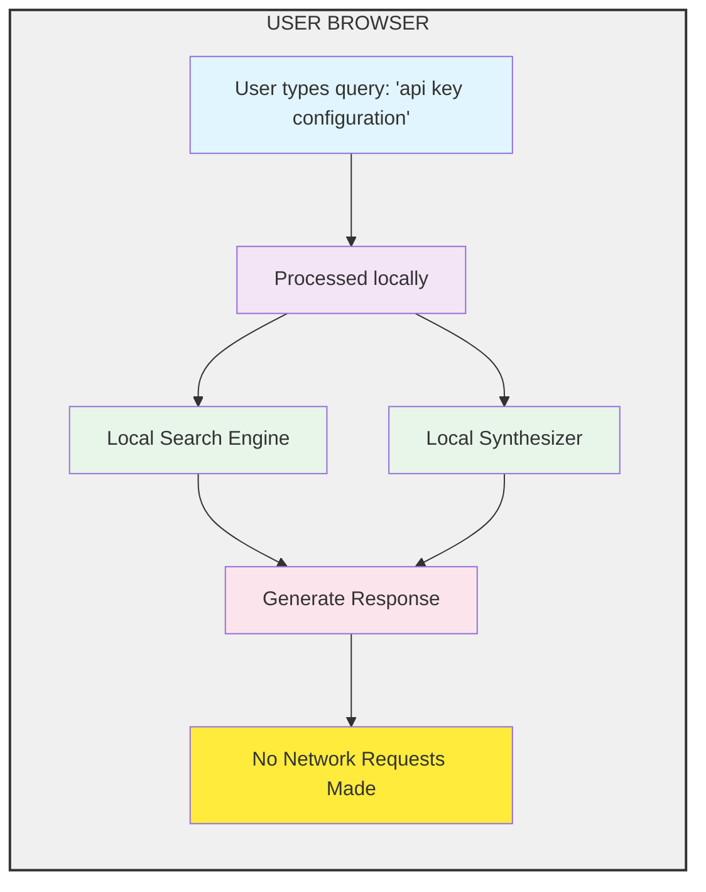

# Privacy by Design: How DepthIndex Protects User Data

Developer privacy is often ignored in modern SaaS documentation platforms. Many search solutions track user queries, record IP addresses, and build user profiles for advertising.

DepthIndex is designed from the ground up to respect developer privacy.

## The Local-First Philosophy

In standard Local mode, **no search query or documentation text ever leaves the user's device.**

Because the index computation, sentence matching, and answer formatting occur entirely in JavaScript inside the browser, there are no remote servers logging what developers are reading.

## Compliance by Default

By keeping user queries local, your documentation site automatically complies with global data protection laws, including:
* **GDPR** (General Data Protection Regulation - Europe)
* **CCPA** (California Consumer Privacy Act - USA)
* **RA 10173** (Data Privacy Act - Philippines)

You do not need to show intrusive cookie banners or update your privacy policies when installing DepthIndex.
