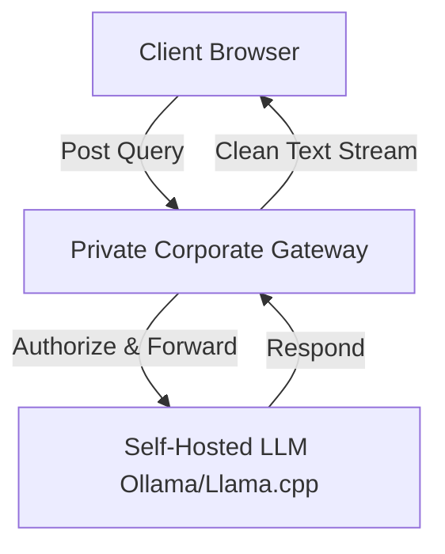

# Self-Hosted AI

## Architecture
Using a custom self-hosted endpoint allows you to route search context through your own servers. This is ideal if you are running local LLMs (such as Ollama or Llama.cpp) or want to secure your API keys behind a private gateway.


## Configuration
Configure a custom endpoint by setting the provider to `'custom'` and specifying your API URL under `cloudAPI`:
```typescript
import { defineConfig } from 'vitepress';
import DepthIndex from 'vitepress-plugin-depthindex';

export default defineConfig({
  vite: {
    plugins: [
      DepthIndex({
        searchMode: 'hybrid',
        cloudAPI: {
          provider: 'custom',
          endpoint: 'https://ai.mycompany.internal/v1/chat/completions',
          model: 'llama3-8b-instruct'
        }
      })
    ]
  }
});
```

## Environment Variables
If your proxy requires custom authorization headers or API tokens, inject them using the following environment variable during compilation:
```bash
VITE_DEPTHINDEX_CLOUD_API_KEY=your_proxy_token
```

## Testing
To test the custom endpoint connection:
1. Ensure your local LLM server or proxy is running and accepting CORS requests.
2. Open your documentation page and send a search query in the chat panel.
3. Verify that requests are routed to your custom URL in the Network tab.
4. Ensure the response format follows the standard OpenAI chat completions schema.
```json
{
  "choices": [
    {
      "message": {
        "role": "assistant",
        "content": "Generated response content."
      }
    }
  ]
}
```
