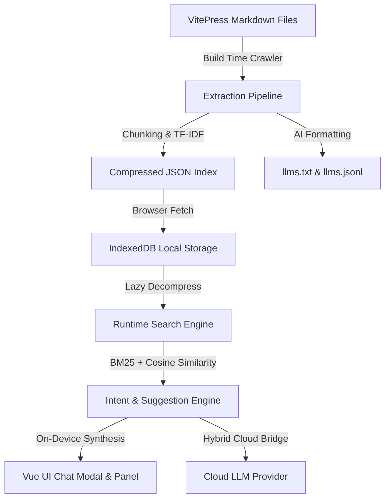

# Overview

## What is VitePress DepthIndex?
**VitePress DepthIndex** is a production-grade, offline-first search and reasoning engine designed to turn standard documentation sites into AI-native experiences. Operating completely inside the user's browser, it combines BM25 exact keyword matching with sparse TF-IDF Cosine similarity vector modeling to enable fast queries without relying on expensive server-side databases or subscription-based paywalls. It runs entirely local search and synthesis, with optional hooks to leverage cloud-based large language models (LLMs) when needed.

## Core Philosophy (on-device, privacy, offline)
DepthIndex is built on three core pillars:
1. **On-Device Autonomy**: We believe documentation should run anywhere, regardless of internet connection. Computations (tokenization, stemming, vector scoring, and TF-IDF construction) are done client-side, eliminating server maintenance costs.
2. **Strict Privacy**: Your data is yours. Using a built-in client-side Privacy Firewall, DepthIndex scrubs sensitive data (such as API keys and PII) on the user's device. No telemetry, IP tracking, or search logs are uploaded to any external server by default.
3. **Offline Resilience**: Documentation must remain functional when developers are offline, traveling, or in secure network environments. By caching data through progressive web application (PWA) service workers, DepthIndex guarantees that search and AI features remain available offline.

## Key Capabilities

### On-Device Search
Using a customized on-device tokenizer and Porter stemmer, DepthIndex parses user queries, matches word roots, and performs keyword expansion. It executes sparse dot-products against unit-normalized TF-IDF vectors, delivering candidate filtering in **~20ms** even for large index files.

### AI Answer Synthesis
DepthIndex features a conversational UI directly on top of your docs. In on-device mode, it synthesizes answers directly in the browser by selecting the most relevant document chunks and formatting them with citation markers.

### Cloud AI Integration
For highly complex reasoning, DepthIndex supports a "Bring Your Own Key" (BYOK) cloud adapter. It resolves query intents local-first, extracts the most relevant document snippets, and streams them to Google Gemini, OpenAI, Anthropic, or custom endpoints.

### Offline PWA
The plugin automatically generates a custom service worker (`depthindex-sw.js`) that handles network-first page caching and cache-first static index preloading. This prevents stale assets while keeping search functional without network access.

### SEO & Discoverability
At build time, DepthIndex crawls documentation to inject semantic meta tags and Open Graph values. It also compiles `llms.txt`, `llms-full.txt`, and `llms.jsonl` files automatically in the output folder, making your documentation easily discoverable by modern AI web crawlers.

## Architecture at a Glance

## Comparison with Alternatives
| Feature | VitePress DepthIndex | Algolia DocSearch | Mendable / Inkeep |
| :--- | :--- | :--- | :--- |
| **Hosting Cost** | $0 (Self-hosted/Client) | Tiered / Enterprise | Subscription-based |
| **Offline Support** | Yes (Service Worker) | No | No |
| **Privacy Compliance** | Local Privacy Firewall | Cloud Processing | External Cloud Process |
| **AI Synthesis** | On-Device & Hybrid | Keyword Search Only | Full Cloud RAG |
| **Setup Complexity** | Zero Configuration | High (Crawl request) | High (API setup) |

## Next Steps
To begin integrating DepthIndex into your VitePress project:
- View the [Quick Start Guide](/guide/quick-start)
- Review the [Installation Reference](/guide/installation)
- Explore [Configuration Options](/guide/configuration)
