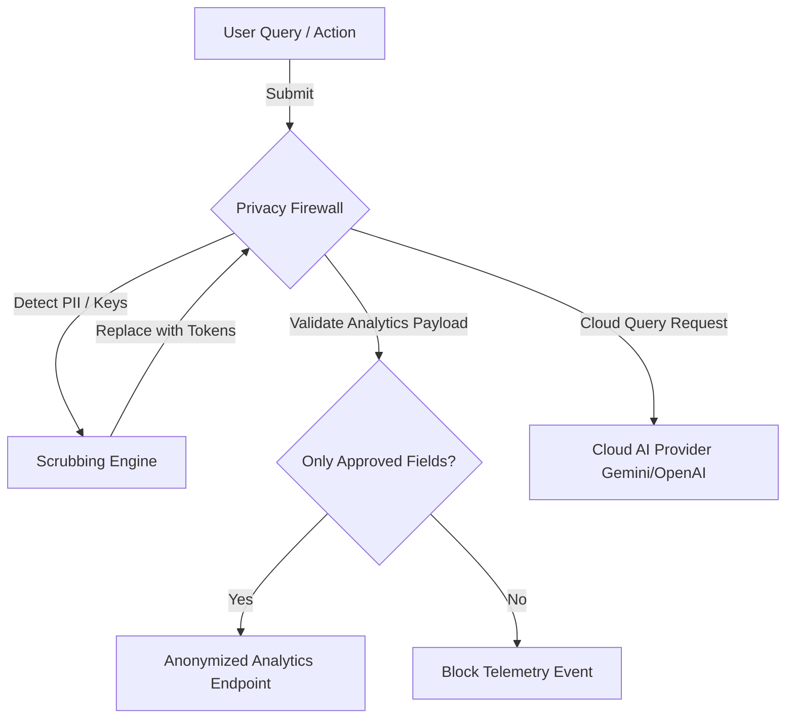

# Privacy Firewall

## Overview
VitePress DepthIndex includes a client-side **Privacy Firewall** (`src/privacy/firewall.ts`) that runs directly in the user's browser. It intercepts all outgoing network requests (such as analytics events and cloud AI calls) to block sensitive configurations and scrub personally identifiable information (PII) on the user's device.

## Protected Data
The firewall identifies and protects the following data variables:

### User API Keys
API tokens entered by users (such as `depthindex-api-key`, `depthindex-openai-key`, `depthindex-gemini-key`, and `depthindex-anthropic-key`) are locked inside local storage. The firewall blocks any outgoing logs containing these keys.

### User Configuration
Settings selected by users (such as `depthindex-user-settings`, `depthindex-language`, and `depthindex-theme`) are kept local to the browser.

### Chat History
All conversational threads, questions, and responses are kept inside local IndexedDB instances, ensuring chat logs are never sent to external servers.

### Personalization Data
Topic affinity scores and query histories are stored locally and are never included in telemetry uploads.

## What Site Owners CAN Access
If analytics are enabled, site owners can access only anonymized, aggregate metrics:
- `total_queries` (total search volumes)
- `top_queries_anonymized` (top search queries with PII scrubbed)
- `zero_result_queries` (queries that returned no results)
- `feedback_ratio` (overall helpfulness scores)
- `page_search_counts` (visit counts per page URL)
- `citation_click_counts` (clicks on references)
- `error_categories` (error counts grouped by type)

## What Site Owners CANNOT Access
Site owners cannot access:
- Raw query histories of individual users.
- User API keys or custom cloud provider configurations.
- Conversational chat transcripts.
- IP addresses, device names, or geolocations.

## PII Sanitization
The firewall uses regular expressions to detect and scrub PII from query strings before sending them to cloud models or analytics servers:
- **API Keys**: Scrubs strings matching API key patterns (e.g. `sk-[a-zA-Z0-9]{20,}`).
- **Email Addresses**: Replaces emails with `[EMAIL]`.
- **Phone Numbers**: Replaces digits matching telephone formats with `[PHONE]`.

## Data Flow Diagram

## Compliance

### GDPR
DepthIndex complies with the General Data Protection Regulation (GDPR). All data tracking is opt-in, and users can delete their data locally at any time.

### CCPA
Complies with the California Consumer Privacy Act (CCPA) by keeping user data local and never sharing or selling personal information.

### RA 10173 (Philippines)
Complies with Republic Act No. 10173 (Data Privacy Act of 2012) by ensuring that personal data processing requires consent and is protected by client-side encryption.

## Security Measures
- **Sandboxed Local Storage**: Stored variables are prefixed (e.g. `depthindex_plugin_*`) to isolate plugin data from other site scripts.
- **Crypto Signatures**: Uses ECDSA signatures (`SHA-256`) to verify index files before loading them into IndexedDB.
- **Zero Tracker Scripts**: The plugin does not load external tracker scripts, preventing third-party tracking.

## Reporting Issues
If you identify a security issue or potential data leak in the firewall:
1. Review the guidelines in [Security Policy](/legal/security).
2. Report the vulnerability to the maintainer via email: `eldrexdelosreyesbula@gmail.com`.
